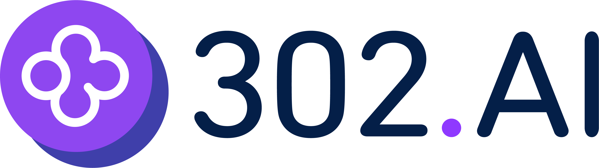

# frontent-park

一个有趣的前端趣味知识公园~ 在线地址：👉🏻 [frontent-park](https://frontend-park.vercel.app/home)

该项目是我平时捣鼓的一些好玩的前端知识案例集合,喜欢的小伙伴也可以自己 fork 到仓库后随意玩耍

<!--  -->

<!-- ## 我的博客

所有示例的具体实现和技术说明，在[我的博客](https://www.fedtop.com/)中都有对应的文章 -->

<!--  -->

## 赞助商

<p align="center">
  <a href="https://gpt302.saaslink.net/hqRIfk" target="_blank">
    
  </a>
</p>

> 302.AI 是一个按需付费的一站式 AI 应用平台，为用户解决 AI 用于实践的最后一公里问题。 [产品链接](https://gpt302.saaslink.net/hqRIfk) | [网站介绍](https://help.302.ai)

## 包含项目

### Tensorflow.js

- [x] 姿态识别

通过摄像头实时识别人体姿态，可以应用于比如：`健身房`、`瑜伽教室`、`舞蹈教室`等等。


### WebRTC 音视频协同

- [x] 拍照

基于 WebRTC 的拍照功能，可以拍照并保存到本地


- [x] 屏幕录制

将获取到的媒体流，通过 MediaRecorder API 进行录制，然后可以下载录制的视频


- [x] 虚拟背景

捕获摄像头后，对背景进行处理


- [x] 无信令传递 (1v1 音视频通话)

手动实现 P2P 的音视频通话，不依赖信令服务器


- [x] 信令传递 (1v1 音视频通话)

通过信令服务器实现 P2P 的音视频通话，支持内/外网连接，可以在不同网络环境下进行通话


- [ ] 搭建 STUN/TURN 服务器
- [ ] 美颜功能
- [ ] WebRTC + Three.js 实现一个有趣的项目
- [ ] WebRTC + TensorFlow.js 实现一个有趣的项目
- [ ] WebRTC + Electron + robotjs 实现远程控制

### ThreeJs

一些 ThreeJs 的代码示例

- 控制器


- 太阳系


### 隐写术

#### 文本隐写

将指定的文本信息，编译成零宽字符，隐藏到一段文本中，用于信息加密等


#### 图片隐写

将图片隐藏到另一张图片中，用于加密或者隐藏信息，版权保护（隐水印）等


未完待续!

- [x] 文本隐写
- [x] 图片隐写
- [ ] 音频隐写
- [ ] 视频隐写

### 千图成像

将选取的若干张图片，通过拼接的方式，合成为一张新指定的图片（马赛克图）


(未完成的功能不影响现在项目的使用,只是一些优化的部分)

- [x] 目标图生成(基本功能) -- 完成
- [ ] 自定义分布方式 -- 待完成
- [ ] 自定义按比例调整 -- 待完成
- [ ] 自定义方向／比例 -- 待完成
- [ ] 自定义贴片高度 -- 待完成
- [ ] 自定义贴片宽度 -- 待完成
- [ ] 资源图片的连续重复控制 -- 待完成

### 机器学习(基于 tensorFlow.js 的前端实现)

    该示例正在捣鼓中...

## 开发

### 安装依赖

```sh
pnpm i
```

## 需要注意的是

由于该仓库有一些依赖包,依赖了二进制文件

如果遇到 `node-pre-gyp ERR! ` `gyp ERR!`等问题,按照下面的方法解决

```sh

# 在node-gyp之前安装 (windows用户在powershell(管理员身份)中安装)
npm install -g --production windows-build-tools

# 全局安装node-gyp
npm install -g node-gyp
```

如果仍然不行,检查本地是否安装了 Python,没有则安装 👉 [官方地址](https://www.python.org/downloads/)

## 本地运行

```sh
pnpm dev
```

## 打包

```sh
pnpm build
```

## 格式化代码并执行 eslint 校验

```sh
pnpm fal
```
